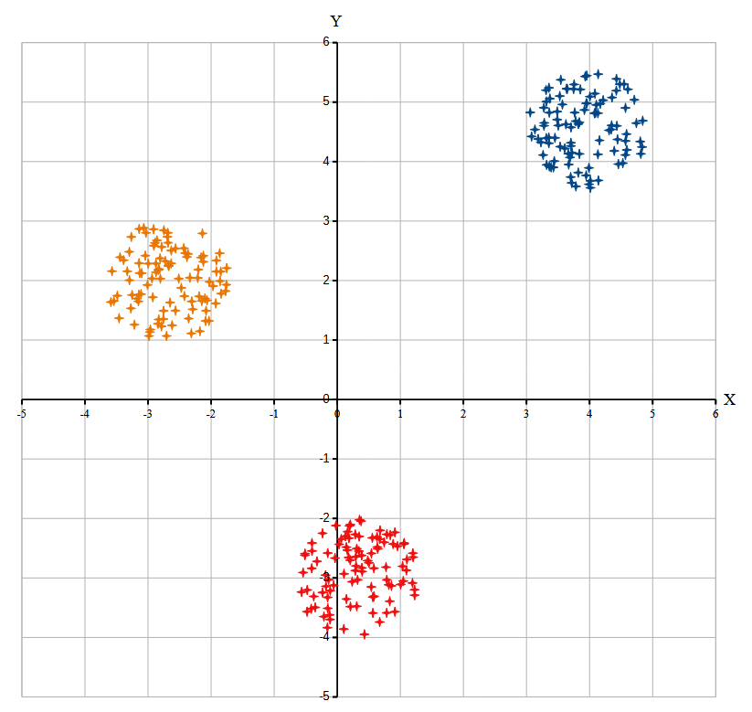

Учёный решил провести кластеризацию некоторого множества звёзд по их расположению на карте звёздного неба. Кластер звёзд – это набор звёзд (точек) на графике, лежащий внутри круга радиусом R  . Каждая звезда обязательно принадлежит только одному из кластеров. Истинный центр кластера, или центроид, – это одна из звёзд на графике, сумма расстояний от которой до всех остальных звёзд кластера минимальна. Под расстоянием понимается расстояние Евклида между двумя точками A(x1,y1) и B (x2,y2) на плоскости, которое вычисляется по формуле:
Формула расстояния между точками A и B:

$$d(A, B) = \sqrt{(x_2 - x_1)^2 + (y_2 - y_1)^2}$$
В файле A хранятся данные о звёздах двух кластеров, где R = 5   для каждого кластера. В каждой строке записана информация о расположении на карте одной звезды: сначала координата x  , затем координата y  . Значения даны в условных единицах, которые представлены вещественными числами. Известно, что количество звёзд не превышает 1000.

В файле Б хранятся данные о звёздах трех кластеров, где R = 8   для каждого кластера. Известно, что количество звёзд не превышает 10 000. Структура хранения информации о звездах в файле Б аналогична файлу А.

Для каждого файла определите координаты центра каждого кластера, затем вычислите два числа: Px   — среднее арифметическое абсцисс центров кластеров, и Py   – среднее арифметическое ординат центров кластеров.

В ответе запишите четыре числа через пробел: сначала целую часть Px ⋅10   для файла А, затем Py ⋅10   для файла А, далее целую часть Px ⋅10   для файла Б и Py ⋅10   для файла Б.

Возможные данные одного из файлов иллюстрированы графиком.

**Внимание!** График приведён в иллюстративных целях для произвольных значений, не имеющих отношения к заданию. Для выполнения задания используйте данные из прилагаемого файла.

